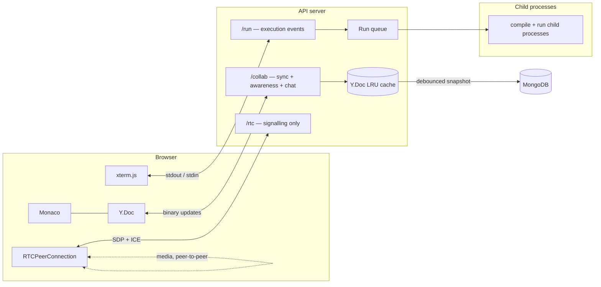

# Architecture

How Codexa fits together, and why each significant decision went the way it did.
[docs/PLAN.md](PLAN.md) has the full design; this is the shorter version aimed
at someone reading the code.

---

## The three subsystems

Three namespaces multiplex over **one** physical socket connection. They are
separate so each gets its own auth middleware and event table, not because they
need separate transports.

---

## Decisions worth defending

### CRDT, not "broadcast the whole file"

The naive approach — send the document on every keystroke, last write wins —
breaks the first time two people type at once: a character vanishes or a cursor
jumps. Operational Transform (what Google Docs uses) needs a central authority
and carefully proven transform functions.

Yjs converges without a central authority, merges offline edits correctly, and
has a maintained Monaco binding. `convergence.test.ts` runs 1000 randomised
interleaved operations across peers with out-of-order delivery and asserts
identical final text; it runs on every push, because if that property breaks
nothing else about the product matters.

### The server holds a real `Y.Doc`, not a relay

Costs memory proportional to open files (bounded by a 200-entry LRU). Buys three
things a relay cannot:

1. A client joining an empty room gets correct state — nobody else is there to
   answer its sync request.
2. There is one authoritative snapshot to persist, so `plainText` is the merge
   of everyone's edits rather than whichever client wrote last.
3. Oversized updates are rejected **before** reaching other clients, so a
   rejected edit can never leave the room divergent from the snapshot.

Persistence is debounced 2s with a hard 30s ceiling (continuous typing keeps
resetting a pure debounce), flushed immediately when the last client leaves, and
flushed again on shutdown — without that last one, a deploy silently discards up
to two seconds of everyone's edits.

### Compile and run are separate processes

This is what makes interactive programs work without a PTY. Each phase gets its
own process with its own pipes, so compiler diagnostics and program output are
never mixed and there is nothing to disambiguate — the earlier container design
needed a per-run random sentinel printed between the phases precisely because a
PTY merged the two streams into one.

What a PTY did buy was line buffering: libc block-buffers stdout when it is a
pipe, so `printf("Enter n: ")` before a `scanf` can sit in the buffer. Python
is launched with `-u` to defeat that. C and C++ programs that prompt without a
trailing newline may still show the prompt late — an accepted limitation, noted
here rather than papered over.

### Output is batched at 30ms and capped at 1 MB

A tight print loop otherwise generates thousands of socket events per second and
pegs the browser's event loop, and exhausts the Node process's memory long
before the wall-clock timeout fires. Batching is the difference between "smooth"
and "the tab freezes".

### The executor is a module behind an interface, not a service

`ExecutionEngine` has one method that matters. The API depends on that and
nothing else. Splitting execution into its own service on day one would cost a
week of plumbing for optionality the interface provides for an afternoon — and
when it does need to move to its own host, it is a new implementation of one
interface rather than a rewrite.

### Roles are checked on every event, not at join

A viewer's socket can emit `sync:update`; nothing in the browser stops it. If
the check lived at room join, read-only would be decorative. `ensureRole` runs
per event, with the resolved role cached on `socket.data` so a keystroke costs
no database read, invalidated by `acl:changed` when membership changes.

### Files are a flat collection, not a nested tree

Nested subdocuments hit Mongo's 16 MB document cap on a large project and make a
single-file update rewrite the whole tree. Flat rows with `parentId` plus a
denormalised `path` keep updates cheap; `services/files.ts` owns every mutation
that could break the `path` invariant and rewrites affected subtrees in one bulk
write.

### Content lives in `ydocs.state`, not in `files`

`plainText` is a derived cache written on the same debounce, used only to
materialise a run workspace and for search. If the two ever disagree, the CRDT
wins. Runs read through the in-memory doc store first, so pressing Run
immediately after typing executes what is on screen — not what was flushed two
seconds ago.

### WebRTC: mesh, capped at four, perfect negotiation

Media is peer-to-peer, so voice costs the server zero bandwidth — the whole
reason for a mesh. Each peer uploads N−1 copies of its stream, which stops
working on residential upload past four; beyond that you need an SFU.

Glare (both peers offering simultaneously) is handled with the standard perfect
negotiation pattern, with politeness decided by comparing peer ids — a value
both sides already agree on. Skipping this produces intermittent, maddening
connection failures.

---

## Two places the plan was wrong

Recorded because the reasoning matters more than the original guess.

### The warm container pool does not work

[PLAN.md §8](PLAN.md) specified a pool of pre-created containers to cut run
latency. It cannot work: a container's bind mounts and environment are **fixed
at create time**, and every run needs a different workspace directory. Reusing a
container that had already executed user code would also violate the rule that
no container runs two users' code.

Dropped — and later the containers went too. The engine now probes for each
language's toolchain at boot and logs what it found, so a missing compiler is a
clear startup line and a named error when you press Run, rather than a button
that silently does nothing.

### Forcing a `monaco` chunk put Monaco back on the landing page

`manualChunks` was used to split Monaco out so the landing page would not pay for
it. Rollup then placed Vite's `__vitePreload` helper into that chunk, which made
the **entry** chunk statically import it — putting a 4 MB module and a 130 KB
stylesheet back on the critical path, the exact thing the chunking was meant to
prevent.

Fixed by lazily importing the route components instead and deleting
`manualChunks` entirely: the dynamic import boundary does the splitting, and
Rollup has no reason to hoist the helper. Importing
`monaco-editor/esm/vs/editor/editor.api` plus only the four grammars we
highlight cut the IDE chunk from 3,799 kB to 2,777 kB on top of that.

`e2e/landing.spec.ts` now asserts no editor asset is requested on the landing
page, so the regression cannot come back silently.

---

## Where this design ends

Documented rather than built, because knowing the ceiling is part of the design:

- **Socket.IO is single-node.** Multi-node needs the Redis or Mongo adapter for
  cross-node broadcast, plus sticky sessions.
- **In-memory `Y.Doc`s pin a room to a node.** Multi-node needs consistent-hash
  routing by `fileId`, or per-document leases.
- **The run queue and rate limiter are in-process.** Multi-node needs BullMQ and
  Redis — the `ExecutionEngine` interface is exactly that seam.
- **The WebRTC mesh caps at four.** Beyond that: an SFU.
