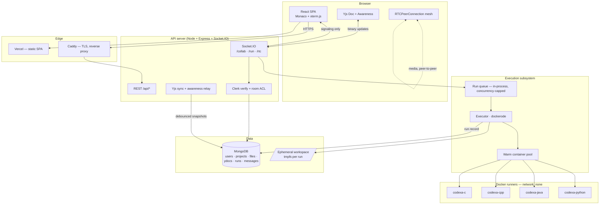

# Codexa — Engineering Plan

> **Historical.** This is the plan as written before implementation. One
> decision changed: execution no longer uses Docker at all. See
> [SECURITY.md §2](SECURITY.md) for what replaced it and what that costs.

**A real-time collaborative web IDE for C, C++, Java, and Python.**

|               |                                                                                    |
| ------------- | ---------------------------------------------------------------------------------- |
| **Scope**     | Portfolio / capstone project — impressive, deployable, buildable solo in ~12 weeks |
| **Frontend**  | React 19 (Vite), Tailwind CSS v4, Monaco Editor, xterm.js                          |
| **Backend**   | Node.js 22, Express 5, Socket.IO 4                                                 |
| **Database**  | MongoDB 7 (Mongoose)                                                               |
| **Auth**      | Clerk                                                                              |
| **Realtime**  | Socket.IO (document sync + presence), WebRTC (voice/video/screen)                  |
| **Execution** | Self-hosted Docker runners, one throwaway container per run                        |
| **Deploy**    | Single VPS + Docker Compose + Caddy; frontend on Vercel                            |

---

## 1. Goals and non-goals

### Goals

1. **Two or more people edit the same file simultaneously** with sub-200ms convergence, visible cursors, selections, and name labels — no lost keystrokes, no "last write wins" clobbering.
2. **Run C, C++, Java, and Python from the browser**, including programs that read from stdin interactively (`scanf`, `Scanner`, `input()`), with output streamed live to a terminal pane.
3. **Feel like an IDE, not a textarea** — file tree, tabs, command palette, split panes, themes, keybindings, resizable layout.
4. **Talk while you code** — WebRTC voice/video and screen share, plus text chat.
5. **Be genuinely safe to expose to the internet** — untrusted code executes in a container that cannot reach the network, the host filesystem, or another user's data.

### Non-goals (explicitly out of scope for v1)

| Not doing                                     | Why                                                                            | Revisit                     |
| --------------------------------------------- | ------------------------------------------------------------------------------ | --------------------------- |
| Full LSP intellisense (clangd, pylsp, jdtls)  | Each language server is a long-lived process per user; blows up the ops budget | v2 stretch (§17)            |
| Installing arbitrary packages (npm/pip/maven) | Requires network in the sandbox + a package cache; large security surface      | v2                          |
| Git operations inside the IDE                 | Nice demo, but orthogonal to the core thesis                                   | v2                          |
| Horizontal scaling / multi-region             | Single node handles the target load comfortably                                | Documented, not built (§13) |
| Mobile editing                                | Monaco is poor on touch; make it _readable_ on mobile, not editable            | Never                       |
| Debugger / breakpoints                        | GDB-over-websocket is a project unto itself                                    | Never                       |

**The bar for "done":** a stranger opens the deployed URL, signs in, shares a link, and a second person joins and writes a C++ program with them that reads two numbers from stdin and prints their sum — in under 60 seconds, with no explanation needed.

---

## 2. Feature scope

### MVP (must ship)

- Clerk sign-in/sign-up, user profile synced to Mongo
- Create / rename / delete projects; a project has a language and a file tree
- File tree: create, rename, delete, move files and folders
- Monaco editor with syntax highlighting for C, C++, Java, Python; tabs for open files
- Real-time collaborative editing via Yjs CRDT over Socket.IO
- Presence: avatar stack, remote cursors + selections with name labels
- Run button → compile + execute in Docker → stdout/stderr streamed to xterm.js
- Interactive stdin: type into the terminal, it reaches the running process
- Stop button kills the run
- Share a project via link; roles: owner / editor / viewer
- Text chat sidebar per project

### V1 (ships by week 12)

- WebRTC voice + video + screen share (mesh, up to 4 peers)
- "Follow user" mode — your viewport tracks theirs
- Command palette (`Ctrl+Shift+P`), keyboard shortcuts, light/dark themes
- Editor settings: font size, tab width, word wrap, vim keybindings toggle
- Run history per project (input, output, exit code, duration, who ran it)
- Custom stdin panel (paste a test input, run non-interactively)
- Offline/reconnect handling — edits made while disconnected merge on reconnect
- Rate limiting, abuse protections, admin metrics endpoint

### Stretch (only if ahead of schedule)

- Snippet library / starter templates per language
- Export project as `.zip`
- Comment threads pinned to a line (like Google Docs)
- Diff view of a session's changes
- AI "explain this code" panel (Claude API)

---

## 3. System architecture



### Why this shape

- **The API server never executes user code itself.** It writes files to a temp dir and asks Docker to run a container over that dir. A compromised runner cannot see the API process.
- **Media never touches the server.** WebRTC is peer-to-peer; Socket.IO carries only SDP offers/answers and ICE candidates. This keeps bandwidth cost at zero and is a genuinely good architectural talking point.
- **The executor is a module behind an interface, not a separate service — on day one.** `ExecutionEngine` has one method: `run(spec): AsyncIterable<RunEvent>`. It runs in-process in the API. If you later need to move it to its own machine, you swap the implementation for an HTTP/queue client and nothing else changes. Splitting services on day one costs you a week of plumbing for zero capstone benefit; the interface costs you an afternoon and buys the same optionality.

---

## 4. Tech stack and rationale

| Layer          | Choice                                                       | Rationale / notes                                                               |
| -------------- | ------------------------------------------------------------ | ------------------------------------------------------------------------------- |
| Build          | Vite 6                                                       | Instant HMR; Monaco needs `vite-plugin-monaco-editor` or explicit worker config |
| UI             | React 19 + Tailwind v4                                       | Tailwind v4's CSS-first config avoids a `tailwind.config.js` sprawl             |
| Components     | Radix UI primitives + custom                                 | Accessible dialogs/menus/tooltips without a heavy design system                 |
| Editor         | `monaco-editor` + `@monaco-editor/react`                     | VS Code's editor — instant credibility, built-in theming and keybindings        |
| Terminal       | `@xterm/xterm` + fit + webgl addons                          | Real ANSI rendering; makes program output look correct                          |
| Client state   | Zustand                                                      | Editor/UI state. Document state lives in Yjs, not Zustand — do not mirror it    |
| Data fetching  | TanStack Query                                               | REST cache, retries, optimistic file-tree mutations                             |
| Routing        | React Router 7                                               | `/`, `/dashboard`, `/p/:projectId`                                              |
| Layout         | `react-resizable-panels`                                     | Draggable IDE splits with persisted sizes                                       |
| CRDT           | Yjs + `y-monaco` + `y-protocols`                             | Battle-tested; handles concurrent edits and offline merge correctly             |
| Transport      | Socket.IO 4                                                  | Auto-reconnect, rooms, namespaces, fallback. Send Yjs updates as binary         |
| Server         | Express 5 + Socket.IO                                        | Express 5 has native async error handling                                       |
| Validation     | Zod                                                          | One schema shared between client and server via `packages/shared`               |
| DB             | MongoDB 7 + Mongoose 8                                       | Document model fits nested file trees and binary CRDT snapshots naturally       |
| Auth           | Clerk (`@clerk/clerk-react`, `@clerk/express`)               | Removes ~2 weeks of auth work; supports OAuth, sessions, webhooks               |
| Docker control | `dockerode`                                                  | Programmatic API — **never** shell out to `docker` with user input              |
| WebRTC         | Native `RTCPeerConnection` (+ `simple-peer` if time-pressed) | Native is ~200 lines and teaches you more; simple-peer is the escape hatch      |
| Logging        | Pino + pino-http                                             | Structured JSON logs, fast                                                      |
| Metrics        | `prom-client`                                                | `/metrics` endpoint; run durations, queue depth, error counts                   |
| Tests          | Vitest, Supertest, Playwright                                | Unit, API, and two-browser E2E                                                  |
| CI             | GitHub Actions                                               | Lint → typecheck → test → build images                                          |

**TypeScript everywhere**, including the backend. Strict mode on. The shared `packages/shared` module holds socket event types and Zod schemas so a rename on the server breaks the client at compile time — this is the single highest-leverage decision in the repo.

---

## 5. Repository structure

```
codexa/
├── apps/
│   ├── web/                     # Vite + React SPA
│   │   ├── src/
│   │   │   ├── routes/          # landing, dashboard, project
│   │   │   ├── features/
│   │   │   │   ├── editor/      # Monaco wrapper, tabs, y-monaco binding
│   │   │   │   ├── filetree/
│   │   │   │   ├── terminal/    # xterm, run controls, stdin
│   │   │   │   ├── presence/    # avatars, remote cursors, follow mode
│   │   │   │   ├── rtc/         # peer mesh, media controls
│   │   │   │   └── chat/
│   │   │   ├── lib/             # socket client, yjs provider, api client
│   │   │   └── stores/          # zustand slices
│   │   └── vite.config.ts
│   └── api/                     # Express + Socket.IO
│       ├── src/
│       │   ├── http/            # routes, middleware, clerk webhooks
│       │   ├── realtime/        # namespaces, yjs sync, awareness, rtc signaling
│       │   ├── execution/       # ExecutionEngine, docker driver, queue, limits
│       │   ├── db/              # mongoose models
│       │   ├── auth/            # clerk verify, room ACL resolution
│       │   └── observability/
│       └── Dockerfile
├── packages/
│   └── shared/                  # socket event contracts, zod schemas, constants
├── runners/                     # one Dockerfile per language
│   ├── c/  cpp/  java/  python/
│   └── build-all.sh
├── infra/
│   ├── docker-compose.yml       # api + mongo + caddy
│   ├── docker-compose.dev.yml
│   └── Caddyfile
├── docs/
│   ├── PLAN.md                  # this file
│   ├── ARCHITECTURE.md
│   ├── SECURITY.md
│   └── DEMO.md                  # the 60-second demo script
└── .github/workflows/ci.yml
```

npm workspaces (not Turborepo/Nx — overkill at this size).

---

## 6. Data model (MongoDB)

```ts
// users — mirror of Clerk, kept in sync by webhook
{
  _id: ObjectId,
  clerkId: string,            // unique index
  email: string,
  username: string,
  avatarUrl: string,
  color: string,              // stable presence color, assigned at creation
  createdAt: Date, lastSeenAt: Date
}

// projects
{
  _id: ObjectId,
  name: string,
  description?: string,
  ownerId: ObjectId,          // -> users
  defaultLanguage: 'c' | 'cpp' | 'java' | 'python',
  members: [{
    userId: ObjectId,
    role: 'owner' | 'editor' | 'viewer',
    addedAt: Date
  }],
  shareToken?: string,        // nullable; unique sparse index
  shareRole: 'editor' | 'viewer',
  isPublic: boolean,
  settings: { tabSize: number, theme: string },
  createdAt: Date, updatedAt: Date
}
// indexes: { ownerId }, { 'members.userId' }, { shareToken } sparse unique

// files — flat collection, tree via parentId (NOT nested docs: avoids the 16MB
// document cap and makes single-file updates cheap)
{
  _id: ObjectId,
  projectId: ObjectId,
  parentId: ObjectId | null,
  name: string,
  type: 'file' | 'folder',
  path: string,               // denormalized '/src/main.cpp' for fast lookup + execution
  language?: string,          // derived from extension
  size: number,
  isEntrypoint: boolean,      // which file `Run` targets
  createdBy: ObjectId,
  createdAt: Date, updatedAt: Date
}
// indexes: { projectId, parentId }, { projectId, path } unique

// ydocs — CRDT state, one per file. Source of truth for content.
{
  _id: ObjectId,
  fileId: ObjectId,           // unique index
  projectId: ObjectId,
  state: Binary,              // Y.encodeStateAsUpdate(doc)
  plainText: string,          // denormalized snapshot for execution + search
  version: number,
  updatedAt: Date
}

// runs
{
  _id: ObjectId,
  projectId: ObjectId,
  triggeredBy: ObjectId,
  language: string,
  entrypoint: string,
  stdin?: string,
  status: 'queued'|'compiling'|'running'|'success'|'error'|'timeout'|'killed'|'oom',
  exitCode?: number,
  compileMs?: number, runMs?: number,
  stdoutBytes: number, stderrBytes: number,
  outputTail: string,         // last 8KB only — never store unbounded output
  createdAt: Date, finishedAt?: Date
}
// index: { projectId, createdAt: -1 }; TTL index on createdAt, 30 days

// messages — project chat
{
  _id: ObjectId, projectId: ObjectId, authorId: ObjectId,
  body: string, createdAt: Date
}
// index: { projectId, createdAt: -1 }
```

**Content lives in `ydocs.state`, not in `files`.** `plainText` is a derived cache written on the same debounce as the snapshot, used only for (a) building the workspace before a run and (b) full-text search. If they ever disagree, the CRDT wins.

---

## 7. Real-time collaboration

### Why CRDT, not "broadcast the whole file"

The naive approach — send the full document on every keystroke, last write wins — breaks the moment two people type at once: one person's character disappears, or the cursor jumps. Operational Transform (what Google Docs uses) needs a central authority and careful transform functions. **Yjs (a CRDT) converges without a central authority, merges offline edits correctly, and has a maintained Monaco binding.** For a solo build this is the only sane choice, and "I used a CRDT and here's why OT was worse for my constraints" is exactly the kind of thing that makes a capstone stand out.

### Transport

Yjs ships providers for WebSocket and WebRTC, but not Socket.IO. Two options:

- **Use `y-socket.io`** (community provider + server) — fastest path, ~1 day.
- **Write a thin provider** over `y-protocols/sync` and `y-protocols/awareness` — ~150 lines client, ~120 server.

**Recommendation: write the thin provider.** It is genuinely small, it removes a dependency on a lightly-maintained package, and it's the part of the project a technical interviewer will actually ask about. Keep `y-socket.io` as the fallback if week 3 runs over.

The protocol, over the `/collab` namespace, room `project:<projectId>:file:<fileId>`:

| Event              | Direction | Payload                     | Meaning                             |
| ------------------ | --------- | --------------------------- | ----------------------------------- |
| `sync:step1`       | C→S       | `Uint8Array` (state vector) | "here's what I have"                |
| `sync:step2`       | S→C       | `Uint8Array` (diff update)  | "here's what you're missing"        |
| `sync:step1`       | S→C       | `Uint8Array`                | server asks client for its diff     |
| `sync:step2`       | C→S       | `Uint8Array`                | client answers                      |
| `sync:update`      | both      | `Uint8Array`                | incremental update, relayed to room |
| `awareness:update` | both      | `Uint8Array`                | cursor, selection, user meta        |

Socket.IO transmits `Uint8Array` as binary frames natively — do **not** base64 it.

### Server-side document lifecycle

```
first client joins file room
  └─> load ydocs.state from Mongo → Y.applyUpdate into an in-memory Y.Doc
      (if absent, create empty doc and seed from files.plainText)
  └─> hold doc in an LRU map keyed by fileId

on sync:update from any client
  └─> Y.applyUpdate(serverDoc, update)
  └─> socket.to(room).emit('sync:update', update)   // relay, excludes sender
  └─> mark dirty; schedule debounced persist

persist (debounce 2s, hard flush every 30s)
  └─> ydocs.state = Y.encodeStateAsUpdate(doc)
      ydocs.plainText = doc.getText('monaco').toString()
      version++

last client leaves room
  └─> flush immediately, then evict from LRU after 60s grace
```

The server holding a Y.Doc (rather than blindly relaying) matters: it means a client who joins an empty room gets correct state, and it gives you a single authoritative snapshot to persist. It costs memory proportional to open files — bounded by the LRU (cap 200 docs) and fine at this scale.

**Backpressure:** a user pasting 5MB generates a huge update. Reject any single update over 1MB and any doc whose text exceeds 2MB, with a clear client-side error. Without this, one paste can wedge the room.

### Awareness (cursors and presence)

Awareness state per client: `{ user: { id, name, color, avatarUrl }, cursor: { anchor, head }, activeFileId }`. Rendered as Monaco decorations — a 2px border-left for the caret, a translucent background for the selection, and a floating name label that fades after 2 seconds of inactivity.

Awareness is **ephemeral** — never persisted, dropped on disconnect via the standard awareness timeout (30s).

**Follow mode:** clicking an avatar subscribes you to that user's `activeFileId` and scroll position (broadcast in awareness). Your editor becomes read-only-ish and tracks theirs; any local keystroke breaks follow. Cheap to build, demos extremely well.

### Reconnection

Socket.IO reconnects automatically. On reconnect the provider re-runs `sync:step1` — Yjs computes the diff and merges both directions. Edits made while offline survive. This is free with a CRDT and is worth an explicit test (§14).

---

## 8. Code execution

This is the highest-risk subsystem and the one that most differentiates the project. Treat every byte of user code as hostile.

### Runner images

One image per language, built from `runners/<lang>/Dockerfile`, all non-root:

| Language | Base                            | Compile                                   | Run                           |
| -------- | ------------------------------- | ----------------------------------------- | ----------------------------- |
| C        | `gcc:14-slim`                   | `gcc -O0 -std=c17 -o /tmp/out main.c -lm` | `/tmp/out`                    |
| C++      | `gcc:14-slim`                   | `g++ -O0 -std=c++20 -o /tmp/out main.cpp` | `/tmp/out`                    |
| Java     | `eclipse-temurin:21-jdk-alpine` | `javac -d /tmp Main.java`                 | `java -Xmx192m -cp /tmp Main` |
| Python   | `python:3.12-slim`              | —                                         | `python -u main.py`           |

Every image ends with:

```dockerfile
RUN useradd -u 10001 -m -s /usr/sbin/nologin runner
USER 10001
WORKDIR /workspace
```

Java's class name must match the filename — validate `public class X` against the entrypoint filename client-side _and_ server-side, and give a helpful error rather than a raw `javac` message.

Python runs with `-u` so output is unbuffered and streams in real time. C/C++ need `setvbuf`-style flushing to stream; since we can't modify user code, allocate a **PTY** for the container (`Tty: true`) which makes libc line-buffer to a terminal. This is the trick that makes interactive C programs feel correct — without it, a `printf("Enter n: ")` before `scanf` shows nothing until the program exits.

### Per-run container configuration (dockerode)

```ts
{
  Image: `codexa-${language}:latest`,
  Cmd: ['/bin/sh', '-c', compileAndRunScript],   // script is static per language;
                                                 // user input NEVER interpolated
  WorkingDir: '/workspace',
  User: '10001:10001',
  Tty: true,                    // PTY → line-buffered output
  OpenStdin: true,
  StdinOnce: false,
  Env: ['HOME=/tmp', 'TMPDIR=/tmp'],
  HostConfig: {
    NetworkMode: 'none',                          // no egress. period.
    Memory: 256 * 1024 * 1024,
    MemorySwap: 256 * 1024 * 1024,                // == Memory ⇒ swap disabled
    NanoCpus: 500_000_000,                        // 0.5 CPU
    PidsLimit: 64,                                // kills fork bombs
    ReadonlyRootfs: true,
    Tmpfs: { '/tmp': 'rw,noexec,nosuid,size=64m' },  // noexec off for compiled langs — see note
    Binds: [`${workspaceDir}:/workspace:ro`],     // source mounted READ-ONLY
    CapDrop: ['ALL'],
    SecurityOpt: ['no-new-privileges:true', `seccomp=${seccompProfile}`],
    Ulimits: [
      { Name: 'fsize', Soft: 32e6, Hard: 32e6 },  // 32MB max file write
      { Name: 'nproc', Soft: 64,   Hard: 64 },
      { Name: 'core',  Soft: 0,    Hard: 0 }
    ],
    AutoRemove: true
  }
}
```

> **Note on `noexec`:** compiled languages need to execute the binary they just produced. Use a second tmpfs at `/build` mounted `rw,nosuid,size=64m` (exec allowed) for the compiler output, and keep `/tmp` `noexec`. Interpreted languages get `noexec` on both.

Layered on top:

- **Wall-clock timeout** — 10s run, 20s compile, enforced by a `setTimeout` that calls `container.kill()`. Never trust the container to stop itself.
- **Output cap** — 1MB total stdout+stderr. On exceed: truncate, emit `run:truncated`, kill. An infinite `while(1) printf` must not OOM the Node process or the browser.
- **Global concurrency cap** — an in-process queue (`p-queue`) with `concurrency = 4` on a 4-vCPU box. Requests beyond that get `status: 'queued'` with a position, shown in the UI.
- **Per-user rate limit** — 20 runs/minute, 300/hour.
- **Warm pool** — keep 2 pre-created paused containers per language. Cold `docker create` + `start` is 400–900ms; reusing a warm container cuts it to ~120ms. Recycle (destroy + recreate) after every run — never reuse a container that has run user code.

### Interactive I/O flow

```
client  --run:start {projectId, entrypoint, stdin?}-->  server
                                                        queue → executor
server  --run:queued {position}-->                      client   (if queued)
server  --run:status {phase:'compiling'}-->             client
server  --run:stderr {chunk}-->                         client   (compile errors)
server  --run:status {phase:'running', runId}-->        client
server  --run:stdout {chunk}-->                         client   (streamed, ~30ms batched)
client  --run:stdin {runId, data}-->                    server   → container stdin
server  --run:exit {code, runMs, reason}-->             client
client  --run:kill {runId}-->                           server   → container.kill()
```

Output chunks are **batched on a 30ms interval** before emitting. A tight print loop otherwise generates thousands of socket events per second and pegs the browser's event loop. Batching is the difference between "smooth" and "the tab freezes."

Run events are broadcast to the whole project room, not just the triggering user — everyone sees the same terminal. That's the collaborative point.

### Workspace materialization

Before a run: create `os.tmpdir()/codexa/<runId>/`, write every file from `ydocs.plainText` for that project preserving `path`, `chmod 0500`, bind-mount read-only. After the run: `rm -rf` in a `finally`, plus a janitor sweeping directories older than 5 minutes on a 60s interval (catches crashes).

Sanitize paths on write: reject any path containing `..`, absolute paths, or symlinks. Path traversal here writes to the _host_ filesystem.

---

## 9. WebRTC (voice, video, screen share)

**Topology: full mesh, hard-capped at 4 peers.** Each peer holds N−1 connections; at 4 peers that's 3 up-streams each — fine on residential upload. Beyond 4 you need an SFU (mediasoup/LiveKit), which is out of scope. Enforce the cap in the server and show "voice room full" past it.

Socket.IO carries signaling only, on the `/rtc` namespace:

| Event                                     | Payload                                      |
| ----------------------------------------- | -------------------------------------------- |
| `rtc:join` / `rtc:leave`                  | `{ projectId }`                              |
| `rtc:peers` (S→C)                         | existing peer list on join                   |
| `rtc:peer-joined` / `rtc:peer-left` (S→C) | `{ peerId, user }`                           |
| `rtc:offer` / `rtc:answer`                | `{ to, from, sdp }`                          |
| `rtc:ice`                                 | `{ to, from, candidate }`                    |
| `rtc:media-state`                         | `{ audio: bool, video: bool, screen: bool }` |

**Glare handling:** when both peers offer simultaneously, use the _perfect negotiation_ pattern — designate the peer with the lexicographically smaller `peerId` as polite, and have it roll back on collision. Skipping this produces intermittent, maddening connection failures.

**ICE servers:** Google's public STUN (`stun:stun.l.google.com:19302`) handles ~80% of NATs for free. Symmetric NATs need TURN — self-hosting coturn is a day of work and bandwidth cost. For a capstone: ship STUN-only, detect ICE failure, and show "couldn't establish a direct connection — your network may require a TURN relay." Honest degradation beats a mysterious black tile. Document it in `SECURITY.md` as a known limitation.

Screen share is `getDisplayMedia()` swapped into the existing sender via `RTCRtpSender.replaceTrack()` — no renegotiation needed, which is a nice touch.

---

## 10. Auth and authorization (Clerk)

### Wiring

- **Frontend:** `<ClerkProvider>` at the root, `<SignedIn>` / `<SignedOut>` guards, `useAuth().getToken()` for the session JWT.
- **REST:** `clerkMiddleware()` from `@clerk/express`, then `requireAuth()` on protected routes. `req.auth.userId` is the Clerk ID.
- **Socket.IO:** the client passes the token in `io(url, { auth: { token } })`. Server-side `io.use()` middleware calls `verifyToken(token, { secretKey })` and attaches `socket.data.user`. **Tokens expire (~60s default), so refresh on the client and re-emit; on `connect_error` with reason `token_expired`, fetch a fresh token and reconnect.** This is the #1 thing people get wrong integrating Clerk with sockets.
- **User sync:** a Clerk webhook (`user.created`, `user.updated`, `user.deleted`) hitting `POST /api/webhooks/clerk`, signature-verified with `svix`. Creates/updates the Mongo `users` doc and assigns the presence color.

### Authorization model

Roles are per-project: `owner` > `editor` > `viewer`.

| Action                                    | owner | editor | viewer |
| ----------------------------------------- | ----- | ------ | ------ |
| Read files, see presence                  | ✓     | ✓      | ✓      |
| Edit documents                            | ✓     | ✓      | —      |
| Create/rename/delete files                | ✓     | ✓      | —      |
| Run code                                  | ✓     | ✓      | ✓      |
| Chat, join voice                          | ✓     | ✓      | ✓      |
| Invite / change roles / rotate share link | ✓     | —      | —      |
| Delete project                            | ✓     | —      | —      |

**Enforcement must happen on every socket event, not just on room join.** A client that joined as a viewer can emit `sync:update` — the server checks role before applying. Resolve the ACL once at join, cache it on `socket.data`, and invalidate it by emitting `acl:changed` and forcing a re-resolve when membership changes.

**Share links:** `shareToken` is a 32-byte random URL-safe string. Visiting `/p/:id?t=<token>` while signed in adds you to `members` with `shareRole`. Owner can rotate or revoke. Never make the token guessable, and never let a token grant `owner`.

---

## 11. API surface

### REST (`/api`)

```
GET    /health                          liveness (no auth)
GET    /metrics                         prometheus (basic-auth)

POST   /webhooks/clerk                  svix-verified user sync

GET    /me                              current user + preferences
PATCH  /me                              update preferences

GET    /projects                        list mine (owned + member)
POST   /projects                        create { name, language, template? }
GET    /projects/:id                    detail + members + file tree
PATCH  /projects/:id                    rename, settings, entrypoint
DELETE /projects/:id                    owner only, cascades files+ydocs

POST   /projects/:id/share              create/rotate share token
DELETE /projects/:id/share              revoke
POST   /projects/:id/join               redeem ?t=<token>
GET    /projects/:id/members            list
PATCH  /projects/:id/members/:userId    change role (owner only)
DELETE /projects/:id/members/:userId    remove / leave

GET    /projects/:id/files              flat list (client builds tree)
POST   /projects/:id/files              create file|folder
PATCH  /files/:fileId                   rename / move (reparent)
DELETE /files/:fileId                   cascade for folders
GET    /files/:fileId/content           plainText (initial load fallback)

GET    /projects/:id/runs?limit=25      run history
GET    /projects/:id/messages?before=   chat history, paginated
```

All bodies validated with Zod schemas imported from `packages/shared`. Errors use a single envelope: `{ error: { code, message, details? } }`.

### Socket namespaces

- `/collab` — sync, awareness, file-tree events (`file:created|renamed|deleted|moved`), chat (`chat:message`), presence
- `/run` — execution events (§8)
- `/rtc` — signaling (§9)

Three namespaces on one connection multiplex over the same transport — no extra sockets, but clean separation of auth middleware and event tables.

---

## 12. Frontend architecture

### Routes

| Route           | Contents                                                             |
| --------------- | -------------------------------------------------------------------- |
| `/`             | Landing page — hero, live demo GIF, "Try a scratch pad" (no signup)  |
| `/dashboard`    | Project grid, create dialog with language templates, recent activity |
| `/p/:projectId` | The IDE                                                              |

### IDE layout

```
┌──────────────────────────────────────────────────────────────┐
│ Logo · Project ▾ │ Run ▸ │ ⏹ │ Lang ▾   Avatars ● ● ●  ⚙ 👤 │
├────┬─────────────┬───────────────────────────────┬───────────┤
│ ▸  │ FILES       │  main.cpp ×  utils.h ×        │  CHAT     │
│ 📁 │ ▾ src/      │ ───────────────────────────── │  ────     │
│ 💬 │   main.cpp  │  1  #include <iostream>       │  Ana: try │
│ 🎥 │   utils.h   │  2  ▏using namespace std;     │  a bigger │
│ 🕘 │ README.md   │  3                            │  input    │
│ ⚙  │             │  4  int main() {   ┃Ana      │  ─────    │
│    │             │                               │  [ ... ]  │
│    ├─────────────┴───────────────────────────────┤           │
│    │ TERMINAL   Output ▾   ⏹ Stop   🗑 Clear     │  🎥 VOICE │
│    │ $ g++ -o out main.cpp                       │  [Ana ]   │
│    │ Enter n: 5▏                                 │  [You ]   │
│    │ Sum = 15                                    │  🎤 📹 🖥  │
│    │ [exited 0 · 84ms]                           │           │
└────┴─────────────────────────────────────────────┴───────────┘
```

All panels resizable and collapsible; sizes persisted to `localStorage`.

### State ownership — the one rule that prevents chaos

| State                                                | Owner                                                                                             |
| ---------------------------------------------------- | ------------------------------------------------------------------------------------------------- |
| Document text                                        | **Yjs `Y.Text`** — Monaco is bound to it via `MonacoBinding`. Never `setValue()` on a bound model |
| Cursors / presence                                   | **Yjs Awareness** → rendered as Monaco decorations                                                |
| File tree, project meta, members                     | **TanStack Query** (server state, invalidated by socket events)                                   |
| Open tabs, active file, panel sizes, theme, settings | **Zustand** (+ `persist` middleware)                                                              |
| Terminal buffer                                      | **xterm.js instance** — an imperative ref, not React state                                        |
| Run status                                           | **Zustand**, driven by socket events                                                              |

Putting document text in React state is the classic failure mode here: every keystroke re-renders the tree, Monaco fights the controlled value, and cursors jump. Monaco and xterm are imperative libraries — hold them in refs and let them own their buffers.

### Monaco specifics

- Load workers explicitly in `vite.config.ts`; the default CDN worker path breaks under CSP.
- One `ITextModel` **per file, kept alive** while the tab is open (models hold undo history — disposing on tab switch loses undo).
- Bind with `new MonacoBinding(yText, model, new Set([editor]), awareness)`.
- Language config: `cpp`, `c`, `java`, `python` are all built in.
- Remote cursors: `editor.createDecorationsCollection()`, updated on awareness change, styled with `::after` pseudo-elements for name labels.
- Register a custom completion provider with language keywords + common stdlib symbols — cheap, and makes it feel alive without an LSP.

---

## 13. Performance targets and scaling notes

### Targets (single 4 vCPU / 8GB VPS)

| Metric                                  | Target                                |
| --------------------------------------- | ------------------------------------- |
| Keystroke → remote render (same region) | p95 < 150ms                           |
| Run cold start (warm pool hit)          | < 250ms to first output               |
| Run cold start (pool miss)              | < 1.2s                                |
| Concurrent editors in one room          | 8                                     |
| Concurrent active rooms                 | 50                                    |
| Concurrent executing containers         | 4 (queued beyond)                     |
| SPA first contentful paint              | < 1.5s                                |
| Monaco lazy-loaded chunk                | not on the landing-page critical path |

### Known ceilings and how you'd break them (document, don't build)

- **Socket.IO is single-node.** Multi-node needs `@socket.io/mongo-adapter` or the Redis adapter for cross-node room broadcast, plus sticky sessions at the load balancer.
- **In-memory Y.Docs pin a room to a node.** Multi-node requires either consistent-hash routing by `fileId` or moving persistence to a shared source of truth with per-doc leases.
- **The run queue is in-process.** Multi-node needs BullMQ + Redis and dedicated executor workers — the `ExecutionEngine` interface (§3) is exactly the seam where that swap happens.
- **WebRTC mesh caps at ~4.** Beyond that: an SFU.

Writing this section is worth as much as building any feature — it demonstrates you know where your design ends.

---

## 14. Testing strategy

| Layer                       | Tool                         | What                                                                                                                                                                                                                                                          |
| --------------------------- | ---------------------------- | ------------------------------------------------------------------------------------------------------------------------------------------------------------------------------------------------------------------------------------------------------------- |
| Unit                        | Vitest                       | Path sanitization, ACL resolution, output truncation, queue ordering, language detection                                                                                                                                                                      |
| CRDT convergence            | Vitest                       | Spin up 3 in-memory Y.Docs, apply 1000 randomized interleaved ops in random order, assert identical final text. **Run this in CI — it's the correctness heart of the app.**                                                                                   |
| API                         | Supertest                    | Every route: 200 happy path, 401 unauth, 403 wrong role, 404 missing, 422 bad body                                                                                                                                                                            |
| Socket                      | `socket.io-client` in Vitest | Two clients join a room, one types, other receives; viewer's `sync:update` is rejected; reconnect merges offline edits                                                                                                                                        |
| **Executor security suite** | Vitest                       | Each must be _contained_, not just fail: fork bomb (`:(){ :\|:& };:`), infinite loop, 10GB allocation, 1GB stdout, `curl example.com`, write to `/etc/passwd`, read `/proc/1/environ`, `../../` path traversal in filenames, 100MB file write, symlink escape |
| E2E                         | Playwright                   | Two browser contexts, two Clerk test users, same project: type in A → assert in B; run a C++ program with stdin → assert output; kill a run; join via share link as viewer → assert read-only                                                                 |
| Load                        | k6 or autocannon             | 50 rooms × 4 clients typing 5 chars/sec for 5 minutes; assert p95 latency and no memory growth                                                                                                                                                                |

The executor security suite is non-negotiable. Every case gets a test that asserts the _container_ died and the _host_ is unaffected — and each one becomes a bullet point in your writeup.

---

## 15. Deployment and operations

### Environments

| Env        | Where                                               | Notes                                              |
| ---------- | --------------------------------------------------- | -------------------------------------------------- |
| Local      | `docker compose -f infra/docker-compose.dev.yml up` | Mongo + API with hot reload; web via `npm run dev` |
| Production | Single VPS (Hetzner CX32 ~€8/mo or DO 4GB ~$24/mo)  | Docker Compose: caddy + api + mongo. Web on Vercel |

**Why a VPS and not Railway/Render/Fly:** the API needs access to a Docker daemon to spawn runners. Managed PaaS either forbids this or requires privileged Docker-in-Docker, which is both fragile and _less_ secure than a plain VPS. Take the VPS.

### The Docker socket, honestly

Mounting `/var/run/docker.sock` into the API container is effectively root on the host. Mitigations, in order of value:

1. **Run the API directly on the host** (systemd, not containerized) so the socket isn't shared into a container at all — simplest and removes the worst of it.
2. Never build a `docker` command string from user input — dockerode only, with static per-language scripts.
3. Restrict what the API may request: hardcode image names, never accept an image from the client, never accept arbitrary `HostConfig` fields.
4. Give the API user membership in the `docker` group rather than running it as root.
5. **Document the residual risk in `SECURITY.md`** and name the production answer: a separate executor host, or gVisor (`--runtime=runsc`) which contains a container escape at the syscall layer for ~15% overhead.

Naming this risk clearly, with a real mitigation path, is stronger than pretending it doesn't exist.

### Also on the box

- Caddy for automatic TLS, HTTP/3, and WebSocket proxying (`reverse_proxy` handles upgrades with no config).
- `mongodump` nightly to a cheap object store (Backblaze B2), 14-day retention. Test the restore once.
- Docker `--log-opt max-size=10m --log-opt max-file=3`, plus a weekly `docker system prune -af --filter until=168h`. Runner images accumulate layers fast; a full disk is the most likely way this dies.
- UFW: only 22, 80, 443. Mongo binds `127.0.0.1` only.

### CI (GitHub Actions)

```
on: [push, pull_request]
  lint      → eslint + prettier --check
  typecheck → tsc --noEmit (all workspaces)
  test      → vitest run (mongodb-memory-server for DB tests)
  e2e       → playwright (main branch only)
  build     → vite build + docker build api + runners
  deploy    → main only: ssh, git pull, docker compose up -d --build
```

### Observability

- **Pino** structured logs with a request/socket correlation id. `console.log` is banned in `apps/api`.
- **`prom-client` at `/metrics`:** `codexa_runs_total{language,status}`, `codexa_run_duration_seconds`, `codexa_queue_depth`, `codexa_active_rooms`, `codexa_connected_sockets`, `codexa_ydoc_cache_size`, plus default Node metrics.
- **Sentry** free tier on both frontend and backend.
- An `/admin` page (owner-only) rendering those metrics — a 3-hour build that makes the whole project look operationally serious.

---

## 16. Roadmap — 12 weeks

Each week ends with something _demonstrable and deployed_. Deploy in week 0, not week 12: the first deploy always takes three times longer than expected, and discovering that in week 12 is how capstones die.

| Week   | Deliverable             | Done when                                                                                                                                                       |
| ------ | ----------------------- | --------------------------------------------------------------------------------------------------------------------------------------------------------------- |
| **0**  | Skeleton + pipeline     | Monorepo, TS strict, Clerk sign-in works, API `/health` responds, CI green, **deployed to the real domain over HTTPS**                                          |
| **1**  | Projects + files        | Dashboard CRUD, file tree with create/rename/delete/move, Mongo models + indexes, ACL middleware, Zod validation                                                |
| **2**  | Single-user editor      | Monaco with tabs, per-file models, save to `ydocs.plainText` on debounce, layout panels, light/dark themes                                                      |
| **3**  | **CRDT sync**           | Custom Yjs↔Socket.IO provider, server-side doc cache + debounced persistence, two tabs edit the same file and converge. Convergence test in CI                  |
| **4**  | Presence                | Remote cursors + selections + name labels, avatar stack, follow mode, reconnect-merge verified, file-tree events broadcast live                                 |
| **5**  | Runner images           | 4 Dockerfiles, non-root, `runners/build-all.sh`, `ExecutionEngine` interface, non-interactive run for all 4 languages, output in xterm                          |
| **6**  | Hardened execution      | All limits from §8 applied, wall-clock timeout, output cap, workspace materialization + janitor, **security test suite green**                                  |
| **7**  | Interactive I/O + queue | PTY streaming, stdin from the terminal, stop button, `p-queue` with position feedback, warm pool, rate limits, run history                                      |
| **8**  | WebRTC                  | Mesh signaling, perfect negotiation, audio/video/screen share, mute/camera controls, 4-peer cap, graceful ICE-failure message                                   |
| **9**  | Sharing + chat          | Share tokens, join flow, role management UI, viewer read-only enforced **server-side**, project chat with history                                               |
| **10** | Product polish          | Command palette, keyboard shortcuts, settings panel, landing page, empty/loading/error states, toasts, mobile-readable, a11y pass (focus traps, ARIA, contrast) |
| **11** | Hardening               | Load test 50×4, fix what it surfaces, Sentry, metrics + `/admin`, backups, `SECURITY.md`, accessibility fixes                                                   |
| **12** | Ship                    | README with GIFs, `ARCHITECTURE.md`, 2-min demo video, case-study writeup, seeded demo project, final deploy                                                    |

**Buffer:** weeks 3 and 6 are the two that overrun. If week 3 slips, drop to `y-socket.io`. If week 6 slips, cut Java to week 7 (it's the fussiest runner) and keep C/C++/Python.

**Cut list, in order, if you fall behind:** screen share → video (keep audio) → follow mode → run history → command palette → chat. Never cut: CRDT sync, presence cursors, interactive stdin, execution hardening. Those four _are_ the project.

---

## 17. Risks

| Risk                                               | Likelihood          | Impact   | Mitigation                                                                                                                |
| -------------------------------------------------- | ------------------- | -------- | ------------------------------------------------------------------------------------------------------------------------- |
| Container escape from user code                    | Low                 | Critical | Full §8 config, no network, drop caps, seccomp, non-root, security test suite; gVisor documented as the production answer |
| Docker socket = host root                          | Certain (by design) | Critical | Run API on host not in container; dockerode only; no user input in commands; documented in `SECURITY.md`                  |
| CRDT sync bugs (dupes, cursor jumps)               | Medium              | High     | Use Yjs (don't write your own); randomized convergence test in CI; never `setValue()` on a bound model                    |
| Socket token expiry breaks connections             | High                | Medium   | Refresh-and-reconnect on `connect_error`; test with a short token TTL                                                     |
| Runaway output freezes the browser                 | High if unhandled   | High     | 30ms batching, 1MB cap, xterm `scrollback: 5000`                                                                          |
| WebRTC fails behind symmetric NAT                  | Medium              | Medium   | STUN-only ship, detect ICE failure, honest UI message, TURN documented                                                    |
| VPS disk fills (images, logs, workspaces)          | High                | Medium   | Log rotation, weekly prune, workspace janitor, disk alert at 80%                                                          |
| Monaco + Vite worker config eats days              | Medium              | Medium   | Solve it in week 2, not week 10; pin the plugin version                                                                   |
| Scope creep (LSP, git, AI)                         | High                | High     | The non-goals table in §1 is a contract with yourself                                                                     |
| Someone abuses the public deploy for crypto mining | Medium              | Medium   | `NetworkMode: none` makes mining pointless; plus rate limits and CPU caps                                                 |

---

## 18. What comes after v1

Ordered by ratio of impressiveness to effort:

1. **Language servers** — clangd / pylsp / jedi over `monaco-languageclient`, one pooled process per language, per-session workspace. Real autocomplete, go-to-definition, inline diagnostics. The single biggest jump in perceived quality.
2. **Persistent workspaces** — a long-lived container per project with a real shell (`docker exec` + PTY → xterm), enabling `pip install`, `make`, multi-file builds, and a genuine terminal.
3. **Git integration** — isomorphic-git or a server-side clone/commit/push, with GitHub OAuth via Clerk.
4. **Session replay** — you already have a CRDT update log; persisting it gives you scrub-through-history playback nearly free.
5. **AI pair programmer** — Claude API for explain/refactor/fix-this-error, with the compile error and surrounding code as context.
6. **SFU for larger calls** — LiveKit or mediasoup past 4 peers.
7. **Multi-node scale-out** — Redis adapter, BullMQ executor workers, dedicated runner hosts (§13).

---

## 19. First three commands

```bash
# 1. scaffold
mkdir -p apps/web apps/api packages/shared runners infra docs
npm init -y && npm pkg set workspaces='["apps/*","packages/*"]' --json

# 2. web
npm create vite@latest apps/web -- --template react-ts

# 3. api
npm i -w apps/api express socket.io mongoose zod @clerk/express dockerode pino yjs y-protocols
```

Then work week 0 top to bottom. Deploy before you build anything else.
